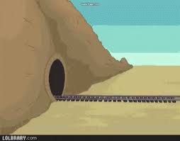
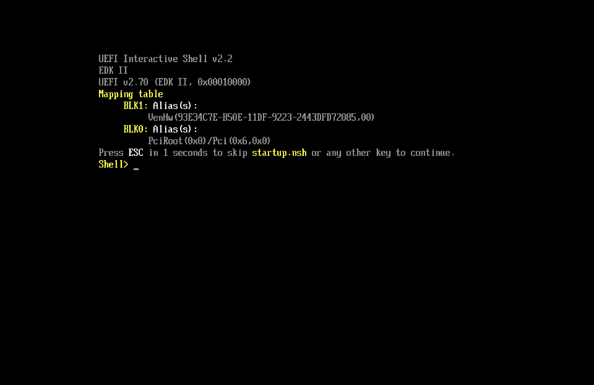
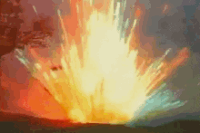

# TP1 : Are you dead yet ?

## Sommaire:

- [TP1 : Are you dead yet ?](#tp1--are-you-dead-yet)

- [I. Intro](#i-intro)

    - [II. Feu](#ii-feu)
        - [première VM](#première-vm)
        - [deuxième VM](#deuxième-vm)
        - [troisième VM](#troisième-vm)
        - [quatrième VM:](#quatrième-vm)
        - [bonus](#bonus)

ON VA PETER DES TRUC !!!


---

## I. Intro

le but de ce tp casser des VMs de 4 manière différentes 

donc go casser de la VM


---

## II. Feu

## première VM:


sa y est c'est pété 


comment avons nous fait ? 

c'est simple on a tout supprimer

pour cela on ce connecter en root de manière a ce qu'il nous casse pas les pied même avec les droits admin et sudo

je me suis rendu a la racine a l'aide de multiple commande 

```
cd ..
```

ainsi, grâce a la commande

```
ls -a -l
```

Qui va nous servir a lister tout ce qui se trouve dans ce dossier  fichier, dossier. ainsi nous sélectionnons le dossier boot.

On rentre dedans grace a la commande

```
cd boot
```

et a partir de ce moment-là, c'est pas compliqué, on supprime tous !!! 

grace a la sainte commande 

```
rm [fichier]
```
et
```
rm -d [doissier vide]
```

on kill la VM pour voir ce que ça donne et 

TADAAAAAAA !!!


## deuxième VM:

Bon ce coup si on a un peut plus du réfléchir, juste un peut plus


on va rester sur de la suppréssion de fichier

petite différence on va rendre la machine inutilisable et au final elle ne bootera juste plus #blackscreen

on ce rend a la racine en root avec la commande 

```
cd ..
```

on fait encore une fois un petit 

```
ls -l
```

pour checker ce qu'il y a d'interessant et il y a un dossier usr comme user

et si on le supprimais ! cette fois si vu qu'il n'est pas vide on va pas tout ce taper a rm sinon y 'en a pour 6 semaines.

on va utiliser le commande 

```
rm -r <dossier>
```

c'est simple cette commande s'en fou de ce que c'est elle le supprime elle pause pas de question 

parfait maintenant checkons si c'est bien remove

```
ls -l
```

oh tient que ce passe-t-il ? 

```
-bash: /usr/bin/ls No such file or directory 
```

marrant ça je suis a la racine et non dans le chemin qu'il donne

dans ce genre de cas la n'importe qui te dirait redemarre ça fait jamais de mal


oh ça alors je ne le crois pas !!!

NAAANNNN je plaisante, c'est exactement ce que j'attendais 


## Troisième VM:

ya un truc utile sur un PC genre sa stock des donner genre l'os, les fichier systeme etc... 

ça s'appelle un disk, posons nous la question que ce passe t'il si on supprime un partition importante

regardon

pour voir nos disk on utilise la commande 

```
fdisk -l
```

qui va lister tout les disque présent sur notre machine

on obtient ceci 

```
[root@localhost ~]# fdisk -l
Disk /dev/vda: 10 GiB, 10737418240 bytes, 20971520 sectors
Units: sectors of 1 * 512 = 512 bytes
Sector size (logical/physical): 512 bytes / 512 bytes
I/O size (minimum/optimal): 512 bytes / 512 bytes
Disklabel type: gpt
Disk identifier: 1D520EC3-17C4-472D-8C39-581910D0FBCB

Device       Start      End  Sectors  Size Type
/dev/vda1     2048  1230847  1228800  600M EFI System
/dev/vda2  1230848  3327999  2097152    1G Linux filesystem
/dev/vda3  3328000 20969471 17641472  8.4G Linux LVM


Disk /dev/mapper/rl-root: 7.41 GiB, 7956594688 bytes, 15540224 sectors
Units: sectors of 1 * 512 = 512 bytes
Sector size (logical/physical): 512 bytes / 512 bytes
I/O size (minimum/optimal): 512 bytes / 512 bytes


Disk /dev/mapper/rl-swap: 1 GiB, 1073741824 bytes, 2097152 sectors
Units: sectors of 1 * 512 = 512 bytes
Sector size (logical/physical): 512 bytes / 512 bytes
I/O size (minimum/optimal): 512 bytes / 512 bytes
```

et si on supprimais le plus gros genre le /dev/vda qui a 3 partition; supprimons les 3 !!! 

pour cela on utilise la commande

```
fdisk /dev/vda/
```

qui va nous donner acces a notre disk avec une suite de commande a executer pour agir dessus 

```
Command (m for help):
```

en regardant le help on apprend que pour supprimer une partion ce qui doit etre une mauvaise idée car on a ce message ecrit ROUGE et en gras 

```
This disk is currently in use - repartitioning is probably a bad idea.
```

donc on peut supposer que ça va tout peter 

parfais c'est ce qu'on cherche 


donc supprimons les partition petit probleme on peut supprimer des partition en fesant ceci 

```
Command (m for help): d
```

sauf que le systeme est quand même un peut proteger et va nous emepcher de le faire vu qu'elle est en cours d'utilisation

donc qu'es qu'on fait quand ça veux pas



on force !


on force la suppression evidemment hein !

on a donc juste a faire ceci

```
Command (m for help): dr
```

ce petit r va tout changer car il ne va plus poser de question 

on selection la partition a supprimer

```
Partition number (1-3, default3):
```
evidement on supprimer les 3

et quand on check

```
[root@localhost ~]# fdisk -l
Disk /dev/vda: 10 GiB, 10737418240 bytes, 20971520 sectors
Units: sectors of 1 * 512 = 512 bytes
Sector size (logical/physical): 512 bytes / 512 bytes
I/O size (minimum/optimal): 512 bytes / 512 bytes
Disklabel type: gpt
Disk identifier: 1D520EC3-17C4-472D-8C39-581910D0FBCB


Disk /dev/mapper/rl-root: 7.41 GiB, 7956594688 bytes, 15540224 sectors
Units: sectors of 1 * 512 = 512 bytes
Sector size (logical/physical): 512 bytes / 512 bytes
I/O size (minimum/optimal): 512 bytes / 512 bytes


Disk /dev/mapper/rl-swap: 1 GiB, 1073741824 bytes, 2097152 sectors
Units: sectors of 1 * 512 = 512 bytes
Sector size (logical/physical): 512 bytes / 512 bytes
I/O size (minimum/optimal): 512 bytes / 512 bytes
```

effectivement les partition vda1 2 et 3 on disparu 

On a un petit message que j'ai oublié de copier coller, mais qui dit que tout va se fonctionner jusque au prochain redémarrage. Donc comme notre but c'est de tout péter évidemment on redémarre et ça alors quelle surprise



c'est casser 

## Quatrième VM:

bon pour cet dernièrer vm on va remplacer des truc important par des truc qui servent a rien 

en gros on va remplacer tout les fichier contenue dans le disque pour des fichier poubelle aleatoire 

```
dd if=/dev/random of=/dev/vda
```

en gros la première partie copie prend comme entrée des données aleatoire et va les copié sur le premier disque ce qui va remplacer les fichier systeme par des fichier poubelle

et a la première commande éxécuter par exemple 

un bête 

```
ip a
```

on passe en black screen, et quand on reboot 


c'est pété

et voilaaaa 

on casser de la vm de 4 manière différentes 

## Bonus:
après si jamais il faut des manière physique de casser des ordinateur en voici quelqu'une 

- un bon coup de mateau 

- renverser un verre d'eau (experience vecu spoileur alerte après ça marche plus du tt)

- envoyer 10 000 V dans la carte mère c'est rigolo ça fait boom 

