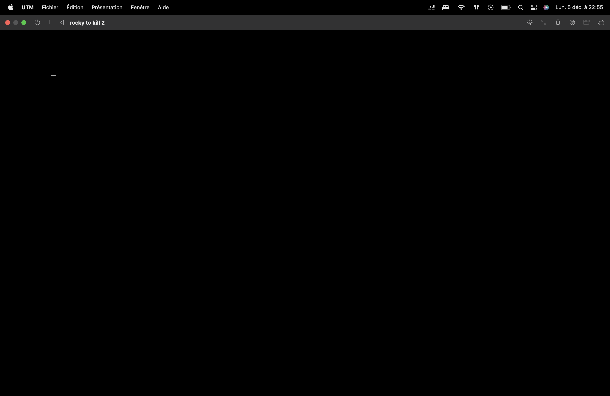

# TP1 : Are you dead yet ?

## Sommaire:

- [TP1 : Are you dead yet ?](#tp1--are-you-dead-yet)

- [I. Intro](#i-intro)

    - [II. Feu](#ii-feu)
        - [première VM](#première-vm)
        - [deuxième VM](#deuxième-vm)
        - [troisième VM](#troisième-vm)

ON VA PETER DES TRUC !!!


---

## I. Intro

le but de ce tp casser des VMs de 4 manière différentes 

donc go casser de la VM


---

## II. Feu

## première VM:


sa y est c'est pété 


comment avons nous fait ? 

c'est simple on a tout supprimer

pour cela on ce connecter en root de manière a ce qu'il nous casse pas les pied même avec les droits admin et sudo

je me suis rendu a la racine a l'aide de multiple commande 

```
cd ..
```

ainsi, grâce a la commande

```
ls -a -l
```

Qui va nous servir a lister tout ce qui se trouve dans ce dossier  fichier, dossier. ainsi nous sélectionnons le dossier boot.

On rentre dedans grace a la commande

```
cd boot
```

et a partir de ce moment-là, c'est pas compliqué, on supprime tous !!! 

grace a la sainte commande 

```
rm [fichier]
```
et
```
rm -d [doissier vide]
```

on kill la VM pour voir ce que ça donne et 

TADAAAAAAA !!!


## deuxième VM:

Bon ce coup si on a un peut plus du réfléchir, juste un peut plus


on va rester sur de la suppréssion de fichier

petite différence on va rendre la machine inutilisable et au final elle ne bootera juste plus #blackscreen

on ce rend a la racine en root avec la commande 

```
cd ..
```

on fait encore une fois un petit 

```
ls -l
```

pour checker ce qu'il y a d'interessant et il y a un dossier usr comme user

et si on le supprimais ! cette fois si vu qu'il n'est pas vide on va pas tout ce taper a rm sinon y 'en a pour 6 semaines.

on va utiliser le commande 

```
rm -r <dossier>
```

c'est simple cette commande s'en fou de ce que c'est elle le supprime elle pause pas de question 

parfait maintenant checkons si c'est bien remove

```
ls -l
```

oh tient que ce passe-t-il ? 

```
-bash: /usr/bin/ls No such file or directory 
```

marrant ça je suis a la racine et non dans le chemin qu'il donne

dans ce genre de cas la n'importe qui te dirait redemarre ça fait jamais de mal



oh ça alors je ne le crois pas !!!

NAAANNNN je plaisante, c'est exactement ce que j'attendais 


## Troisième VM:

