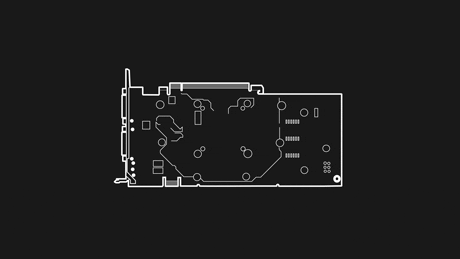

# TP1 : Are you dead yet ?

## Sommaire:

- [TP1 : Are you dead yet ?](#tp1--are-you-dead-yet)

- [I. Intro](#i-intro)

    - [II. Feu](#ii-feu)

ON VA PETER DES TRUC !!!


---

## I. Intro

le but de ce tp casser des VMs de 4 manière différentes 

donc go casser de la VM



---

## II. Feu

## première VM:


sa y est c'est pété 

[petit-grub-psk-cpt](picture/capture-cpt-1.png)

comment avons nous fait ? 

c'est simple on a tout supprimer

pour cela on ce connecter en root de manière a ce qu'il nous casse pas les pied même avec les droits admin et sudo

je me suis rendu a la racine a l'aide de multiple commande 

```
cd ..
```

ainsi, grâce a la commande

```
ls -a -l
```

Qui va nous servir a lister tout ce qui se trouve dans ce dossier  fichier, dossier. ainsi nous sélectionnons le dossier boot.

On rentre dedans grace a la commande

```
cd boot
```

et a partir de ce moment-là, c'est pas compliqué, on supprime tous !!! 

grace a la sainte commande 

```
rm [fichier]
```
et
```
rm -d [doissier vide]
```

on kill la VM pour voir ce que ça donne et 

TADAAAAAAA !!!

