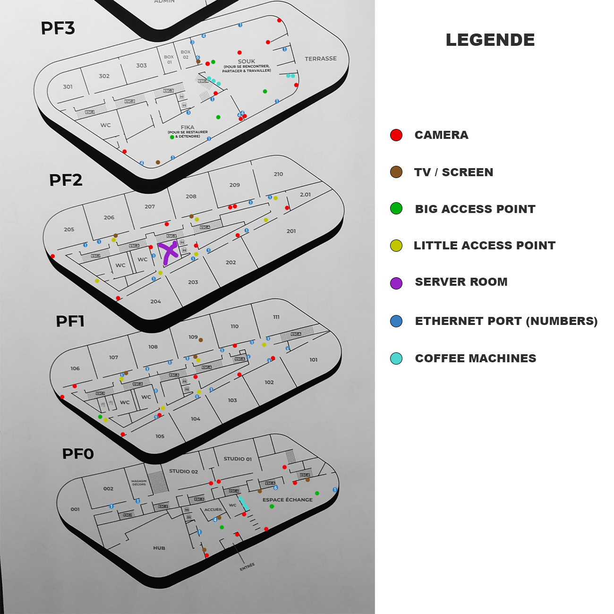
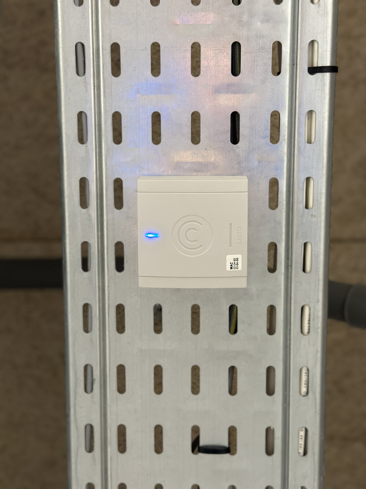

# TP3 SECU : SVP soyez cools

- [TP3 SECU : SVP soyez cools](#tp2--environnement-virtuel)
    - [1. on va voir si on peut ce brancher a des trucs](#1-on-va-voir-si-on-peut-ce-brancher-a-des-trucs)
    - [2. les nmap](#2-les-nmap)

Bon spoiler on a été cool maiiis on est passer pour des mec chelou en viteuf

## 1. on va voir si on peut ce brancher a des trucs 

Déja on a répertorier et cartographier en speed l'infra du bat et ça donne ça



Pour débrief très rapidement le plan, on as les emplassement des caméra de sécuriter qui ne sont evidemment pas sur le même réseau que nous, les tv / screen,
les salles des server présente au 1er et second étage, les machines a café (on verra après pk on les a mis)
et on a rajouter les grosse borne wifi 

donc celle la 


on va les retrouver généralement dans les salle de cours et dans les grand espace genre que le souk

et il y a aussi les petites borne qu'on retrouve dans les couloir 

donc celle-ci




on a essayer les prise RJ45 jusqu'a ce qu'on trouve ça


pour decrire ceci c'est un switch (ça ce vois je pense) derierre les machines a café du souk sur lequelle il reste pile une prise RJ45 sur laquelle nous connecter

evidemment qu'on c'est brancher dessus

et on a trouver des truc sympa

voyons ça

<!--resultat scan filaire switch machine a café-->
```
PS C: \Users \Miste> nmap -sn 192.168.1.1/24
Starting Nmap 7.94 (https://nmap.org ) at 2023-10-26 12:22 Paris, Madrid (heure daútú)

scan report for RUT241.1an (192.168.1.1)
Host is up (0.0015s latency).

MAC Address: 90:1E:42:63:CC:D3 (Teltonika)
Nmap scan report for 192.168.1.142
Host is up (0.0010s latency).

MAC Address: 10:1E:DA:4B: BD:0C (Ingenico Terminals SAS)
scan report for 192.168.1.183
Host is up (0.0030s latency).

MAC Address: 10:1E:DA:4B:BD:CB (Ingenico Terminals SAS)
Nmap scan report for 192.168.1.188
Host is up (0.0010s latency).

MAC Address: 10:1E:DA:4B:BB:9C (Ingenico Terminals SAS)
Nmap scan report for 192.168.1.192
Host is up (6.0040s latency).

MAC Address: 00:08:DC:41:63:38 (Wiznet)
Nmap scan report for 192.168.1.218
Host is up (0.0070s latency).

MAC Address: 00:08:DC:3C:09:43 (Wiznet)
map scan report for 192.168.1.234
Host is up (0.0033s latency).

MAC Address: 00:08:DC:41:63:62 (Wiznet)
Nmap scan report for DESKTOP-ODDOLFJ.lan
(192.168.1.223)
```

le teltonika c'est le switch

et ce a quoi on s'attendais pas en ce branchant c'est qu'on a récuperer les ip des... 

roulement de tambour 


les ligne avec ingenico c'est les mac et les ip des terminaux de paiment par carte des machines

plutot sympa hein on a pas été plus loin mais pas peu fière

bien c'est tt pour la partie physique 

## 2. les nmap


Grâce au scan NMAP du réseau nous avons pu récupérer des données tel que : 
- OS des users
- les services qui tournent dessus (via les ports) : SSH, Ftp, HTTP, et serveur Minecraft (on oublie pas les ptit gamers qui jouent en cachette)

par exemple ici : 

ON voit qu'un serveur Apache est ouvert avec sa version, également le ssh (avec les ssh hostkey) activé puis son OS. 

```
Nmap scan report for 10.33.66.200
Host is up (0.0071s latency).

PORT      STATE  SERVICE      VERSION
21/tcp    closed ftp
22/tcp    open   ssh          OpenSSH 9.0p1 Ubuntu 1ubuntu8.5 (Ubuntu Linux; protocol 2.0)
| ssh-hostkey: 
|   256 6513c5684e63cbc98173505874cd7fcb (ECDSA)
|_  256 a92e576a164cfe46fcd3f958f88da877 (ED25519)
80/tcp    open   http         Apache httpd 2.4.55 ((Ubuntu))
|_http-title: Apache2 Ubuntu Default Page: It works
|_http-server-header: Apache/2.4.55 (Ubuntu)
| http-methods: 
|_  Supported Methods: GET POST OPTIONS HEAD
139/tcp   closed netbios-ssn
443/tcp   closed https
445/tcp   closed microsoft-ds
25565/tcp closed minecraft
Service Info: OS: Linux; CPE: cpe:/o:linux:linux_kernel
```

Ici comme c'est indiqué certains ports sont fermé, nous avons 3 possibilité : filtered, open ou closed

Filtered est simplement le fait que nous n'avons pas pu envoyé de paquet pour diverses raison comme le firewall par exemple

Le scan complet se trouve juste ici : [SCAN_NMAP](Scan.txt)